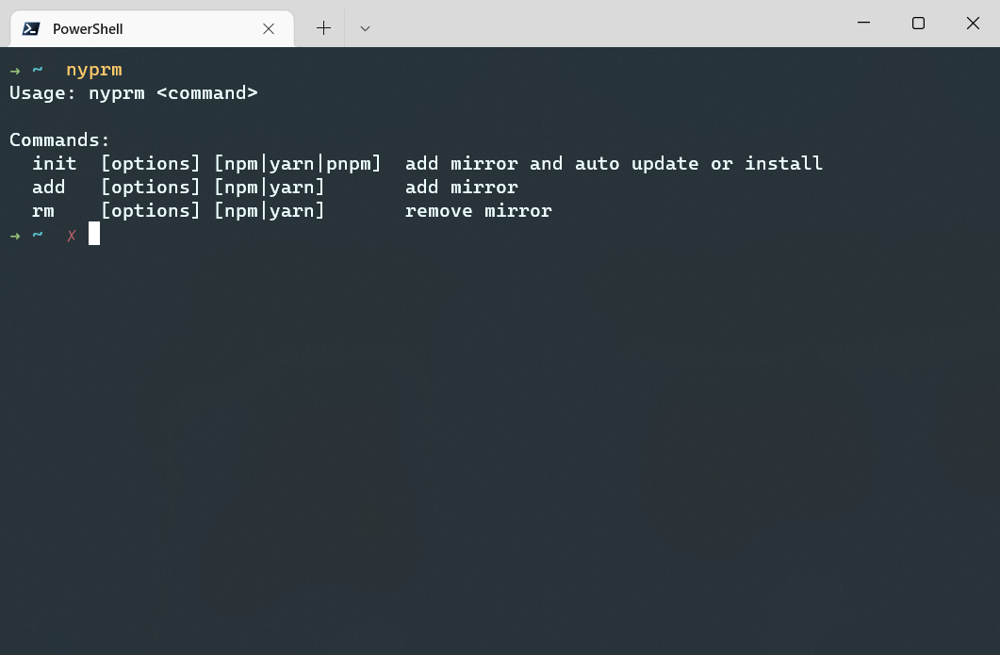

# nyprm

一个 npm yarn pnpm 的镜像切换工具

## 特别说明

不同于其他工具的逻辑

该工具的镜像站只有 [npmmirror 中国镜像站](https://npmmirror.com/)

然后我自己加了 electron 和 electron-builder 的镜像

## 如何使用



### init

```bash
nyprm init
```

同时为 npm yarn pnpm 添加镜像并自动更新或安装

```bash
nyprm init npm # yarn
```

为 npm 添加镜像并自动更新或安装

### add

```bash
nyprm add
```

同时为 npm yarn pnpm 添加镜像

```bash
nyprm add npm # yarn
```

为 npm 或 yarn 添加镜像

> 注：pnpm 使用 npm 的镜像

### rm

```bash
nyprm rm
```

同时为 npm yarn pnpm 去除镜像

```bash
nyprm add npm # yarn
```

为 npm 或 yarn 去除镜像
